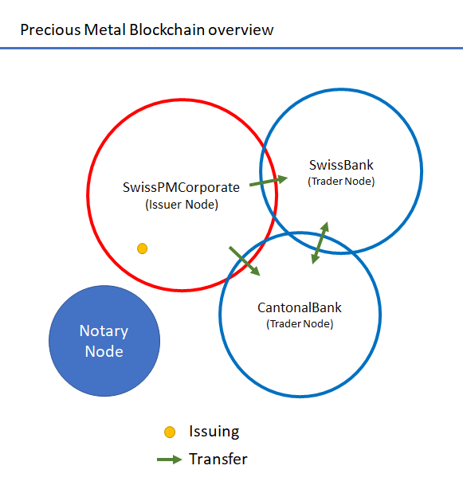
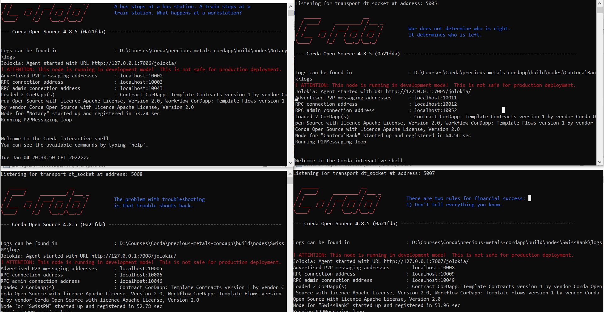

= Precious Metal Blockchain

== Project Description:

* This project is a PoC using Corda for the issuing the physical precious metals.
    - If you are not familiar with Corda find the following links that will help with the concepts that will be mentioned.
    - Corda link https://docs.r3.com/en/get-started/corda-key-concepts.html
* The blockchain requires at least the following:

=== State

* The state is the precious metals itself
* The definition is by
    - Type that can be gold, solver
    - Units that can be in kg, g, oz
    - and Weight

== Contract

* There is a single contract with two commands used for issuing and transfer

== Workflows

* Two flows are defined:
    - Issuing Flow

        + Only a node defined as issuer will be able to execute this flow in order to add new precious metals to the ledger

    - Transfer Flow

        + Once a precious metal are added to the ledger they can be transfer for custodian to other traders

    - Search Flow

        + to simplify the searching in the vault

IMPORTANT: The transfer of cash still pending to do

=== Nodes

* The following nodes will

    - one notary node:

        + for validation porposes

    - one issuer node:

        + this node will issue the phisical bars or coins, that's mean new precious metals can be offered
        + during issuing this node will be the owner of the bars

    - two traders node

        + once the new precisous metals is add added to the ledger, traders can adquire them and transfert the precius metals between traders only

== Project

=== Prerequisites
* Corda 4.8.x
* Java 8

=== Building

* Go to <WORKSPACE>/

* To launch the tests:

	gradle clean build

* To build the nodes run

	./gradlew clean deployNodes

* Then run nodes

    - windows

	<workspace>build\nodes\runnodes.bat

    - linux

	<workspace>build\nodes\runnodes

== Interacting with the nodes:

=== Building

* Once the nodes are running you will see 4 shell that can be used to interact with the nodes

* To see list of flows:

	flow list

* To issue new precious metals go to the node SwissPMCorporate:

	start PreciousMetalIssuingFlowInitiator metalName: Gold Bar, unit: g, weight: 100
	start PreciousMetalIssuingFlowInitiator metalName: Gold Bar, unit: g, weight: 100
	start PreciousMetalIssuingFlowInitiator metalName: Silver Bar, unit: K, weight: 1
	start PreciousMetalIssuingFlowInitiator metalName: Gold Coin, unit: oz, weight: 1
	start PreciousMetalIssuingFlowInitiator metalName: Gold Coin, unit: oz, weight: 1
	start PreciousMetalIssuingFlowInitiator metalName: Silver Coin, unit: oz, weight: 1
	start PreciousMetalIssuingFlowInitiator metalName: Silver Coin, unit: oz, weight: 1

* Now that SwissPMCorporate issued some Bars and coins, to transfer from the issuer to banks

- In the same Node SwissPMCorporate

	start PreciousMetalTransferFlowInitiator metalName: Gold Bar, unit: g, weight: 100, buyer: "O=SwissBank,L=Zurich,C=CH"

* And to transfer from bank to bank

- In the same Node SwissBank

	start PreciousMetalTransferFlowInitiator metalName: Gold Bar, unit: g, weight: 100, buyer: "O=CantonalBank,L=Geneva,C=CH"

* To confirm the transfer was done

	run vaultQuery contractStateType: com.template.states.PreciousMetalState

=== Corda Help

* https://www.corda.net//[Corda.net]
* Also see: https://docs.corda.net/tutorial-cordapp.html#running-the-example-cordapp.

== Cordapp

image::https://www.corda.net/wp-content/uploads/2016/11/fg005_corda_b.png[]

* This PoC was build using Java CorDapp template. The CorDapp template is a stubbed-out CorDapp that you can use to bootstrap your own CorDapps.
* https://github.com/corda/cordapp-template-java/[CorDapp Template - Java]
* This is the Java version of the CorDapp template. The Kotlin equivalent is
* https://github.com/corda/cordapp-template-kotlin/[CorDapp Template - Kotlin]

